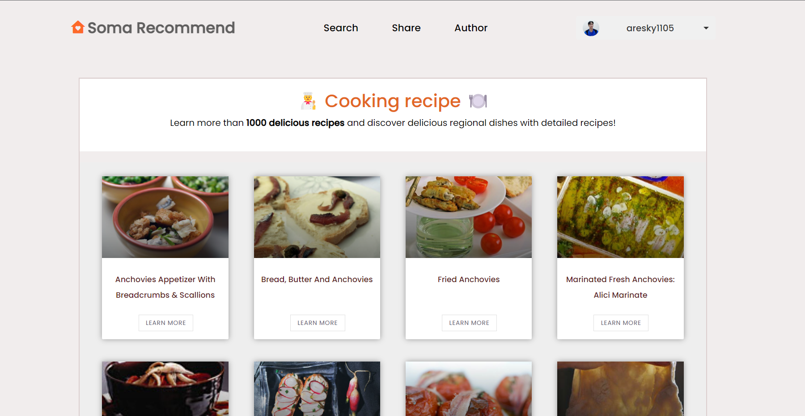

# Let's Build a Food Recipe App
React API Project Tutorial Using Hooks, Axios, Redux-toolkit and Cloudinary



### Created & Maintained By

[LINUX TEAM](https://github.com/sudo-u-Hung-NN/FE-ITSS1-Linux)


## NPM Scripts for Front End

- Step1: In the project directory, install the libraries:

```bash
    npm install
```
If errors, try:
```bash
    npm install --force
```
- Start your project: 

```bash
    npm start
```

Runs the app in the development mode.\
Open [http://localhost:3001](http://localhost:3001) to view it in the browser.

The page will reload if you make edits.\
You will also see any lint errors in the console.

## NPM scripts for 'backend' folder

- Lint check and fix

```bash
  npm run lint
```

- TypeOrm create empty migration file

```bash
  npm run typeorm:create --name=file_name
```

- TypeOrm migration run

```bash
  npm run typeorm:up
```

- TypeOrm migration revert

```bash
  npm run typeorm:down
```
## Stay in touch

- Author - [Aresky-T](https://github.com/Aresky-T)